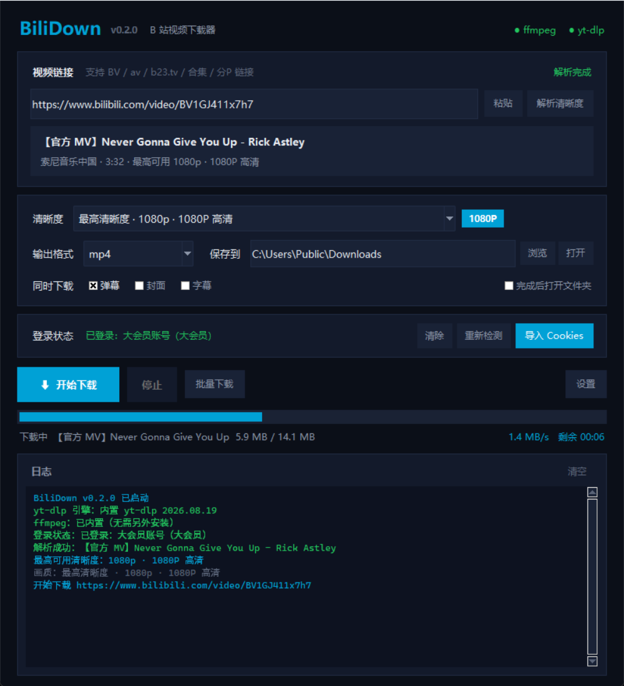

# BiliDown v0.2 — B 站视频下载器

零依赖的 B 站视频下载工具。图形界面（GUI）与命令行（CLI）共用同一套下载核心，
打包后的成品**整包复制到任何一台 Windows 电脑就能用**，不需要装 Python、ffmpeg 或 yt-dlp。



> 成品位置：`成品\v0.2\BiliDown.exe`（482 MB，其中 432 MB 是内置的 ffmpeg）
> 验收状态：`python verify_v02.py` → 29 项全部通过

---

## 一、v0.2 做了什么

### 1. 「最高清晰度」现在名副其实（核心修复）

旧版的「最高清晰度」是一个写死的 `bv*+ba/b`，把选择权完全交给 yt-dlp，
界面上写着“最高”，实际拿到什么全看运气 —— 尤其在 Cookies 过期时，
界面上仍显示“最高清晰度”，下载下来却只有 480P。

v0.2 改成 **先探测、再精确选择**：

| 步骤 | 说明 |
|---|---|
| ① 解析 | 粘贴链接后自动调用 B 站接口，取出该视频**当前真实可用**的全部分辨率 |
| ② 归档 | 同一高度只保留最好的一档（帧率高 → 码率高），从高到低排序 |
| ③ 精确选择 | 「最高清晰度」绑定 `bestvideo[height=2160][fps=60]+bestaudio/best` 这样的**精确选择器**，而不是模糊的 `best` |
| ④ 如实显示 | 若当前只有 480P，下拉框就只列 480P，并明确提示原因 |

下拉框里的档位会随视频实时刷新，第一项永远是这部视频此刻能拿到的最高档。

### 2. 明确告知登录状态（画质低下的真正原因）

B 站按登录状态分级放行，这是绝大多数“为什么只有 480P”的根源：

| 登录状态 | 最高可用 |
|---|---|
| 未登录 | 480P |
| 已登录（普通） | 1080P |
| 已登录（大会员） | 4K / 8K / HDR / 杜比视界 |

程序启动即调用 `x/web-interface/nav` 校验 Cookies 是否仍然有效，并显示：

```
登录状态  已登录：xxxxx（大会员）
登录状态  未登录 / Cookies 已失效
```

> 本项目原有的 `www.bilibili.com_cookies.txt` 已经过期，请重新导出。

### 3. 界面平滑度

- **进度条插值动画**：按 30fps 向目标值缓动，不再一跳一跳
- **进度单调递增**：B 站先下视频流再下音频流，分母中途变大会让进度条倒退，已封顶处理
- **日志批量刷新**：改为队列 + 定时批量插入（旧版每行一次 `after`，日志一多就卡）
- **移除全局滚轮劫持**：旧版 `bind_all("<MouseWheel>")` 导致在日志框里滚动会带着整页跑
- **DPI 感知时机修正**：旧版在 `tk.Tk()` 之后才声明 DPI 感知，界面被系统二次缩放而发虚
- **ttk 样式修正**：滚动条样式名 `V.Scrollbar` 会继承到没有 layout 的 `Scrollbar`，
  渲染成空白 —— 已改为 `Q.Vertical.TScrollbar`

### 4. 体验与功能

- 粘贴链接后**自动解析**（防抖 650ms），无需手动点按钮
- 显示标题 / UP 主 / 时长 / 分P 数 / 最高可用画质
- **分P 下拉选择**，合集可只下某一段
- **批量下载**：一次粘贴多行链接，顺序下载
- 附加内容：**弹幕**（`.danmaku.xml`，与视频同名同目录）、封面、字幕
- **仅音频**：`m4a` / `mp3`
- 设置持久化（`config.json`），窗口位置、目录、格式都会记住
- 下载/合并/转码分阶段显示，速度与 ETA 实时更新
- 错误信息汉化：403/412/429、需要登录、需要大会员、磁盘满、写权限等
- 完成后自动打开文件夹（可选）

### 5. 修复的已知 bug

| 问题 | 后果 | 状态 |
|---|---|---|
| `args_list[-1]` 被当成 URL | 冻结版实际请求的是 `Referer:` 请求头文本 | 已重写，改用 yt-dlp Python API |
| 冻结版把 `progress_hooks` 清空 | 打包后**完全没有进度显示** | 已改用真实 progress hook |
| 冻结版取消只是设置标志位 | 「停止」按钮无效，任务仍在跑 | 已改用 `DownloadCancelled` |
| `tools/yt-dlp.exe` 实为 108KB 的 pip 脚本壳 | 拷到没装 Python 的电脑上直接失效 | 已删除，改为内置 yt-dlp 模块 |
| `.bat` 内写中文 | cmd 按 OEM 代码页解析，全是乱码 | .bat 改为纯 ASCII，中文由 Python 输出 |
| 全局滚轮绑定 | 日志框滚动带动整页 | 已移除 |
| DPI 感知调用时机 | 高分屏界面发虚 | 移到 `tk.Tk()` 之前 |
| 音质档位 key 重复 | 下拉框出现多条一模一样的“仅音频” | 按编码家族去重 |
| 弹幕功能依赖 `cid`，而 yt-dlp 不返回该字段 | 弹幕永远下不下来 | 改为查询 `web-interface/view` 接口 |

---

## 二、目录结构

```
爬取视频/
├── 成品/v0.2/              ← 打包成品（拷贝这个文件夹即可用）
│   ├── BiliDown.exe        主程序
│   ├── _internal/          Python + yt-dlp 运行库（1089 个文件）
│   ├── tools/              ffmpeg.exe / ffprobe.exe（共 432 MB）
│   ├── downloads/          默认下载目录
│   ├── 界面预览.png        界面截图
│   └── 使用说明.txt
│
├── bili_core.py            共享核心：探测 / 清晰度 / 下载 / 弹幕
├── bili_gui.py             图形界面（真正的实现）
├── bili_down_gui.pyw       双击启动入口（开发用，转调 bili_gui）
├── main.py                 统一入口：GUI + 无人值守自检参数
├── BiliDown.spec           PyInstaller 打包配置
├── build_v02.py            一键打包 + 组装成品
├── verify_v02.py           成品验收：干净环境下跑通自检/探测/下载
├── 界面预览.png             界面截图（会一并复制进成品）
├── app.ico / app.png       应用图标
├── 命令/
│   ├── bili.bat            CLI 启动器（纯 ASCII）
│   └── bili_cli.py         CLI 实现
├── tools/
│   ├── ffmpeg.exe
│   ├── ffprobe.exe
│   └── make_icon.py        图标生成（开发用）
├── downloads/              下载目录
├── .gitignore              忽略登录凭证与打包中间产物
└── www.bilibili.com_cookies.txt
```

---

## 三、怎么用

### GUI（推荐）

- **成品**：双击 `成品\v0.2\BiliDown.exe`
- **源码**：双击 `启动BiliDown.vbs`（需要本机有 Python）

### 命令行

```cmd
cd 命令
bili info BV1GJ411x7h7          查看真实可用清晰度
bili BV1GJ411x7h7               下载最高清晰度
bili BV1GJ411x7h7 -q 1080p      指定清晰度
bili BV1GJ411x7h7 -q 2          按列表序号选择
bili BV1GJ411x7h7 -f mp3        仅下载音频
bili BV1GJ411x7h7 -i 1,3        只下载第 1、3 个分P
bili login                      检查 Cookies 登录状态
```

---

## 四、如何获取 Cookies

这一步决定你能下到多高的画质，**是整个工具最值得花 2 分钟的地方**。

### 4.1 为什么必须弄

B 站按登录状态分级放行（见 [§1.2](#2-明确告知登录状态画质低下的真正原因)）：

| 登录状态 | 最高可用画质 |
|---|---|
| 不带 Cookies（匿名） | 480P |
| 已登录（普通用户） | 1080P |
| 已登录（大会员） | 4K / 8K / HDR / 杜比视界 |

> ⚠️ 仓库里自带的 `www.bilibili.com_cookies.txt` **已经过期**。
> 不过过期也不会让你只能下 480P —— 程序检测到失效会自动改发匿名请求
> （实测带失效 Cookies 反而被压到 480P，不带才是 1080P）。
> 想上 1080P 以上，还是得重新导出一份有效的。

### 4.2 准备工作

- 一个你**已经登录 B 站**的浏览器（Chrome / Edge / Firefox 都行）
- 打开 <https://www.bilibili.com>，确认右上角是自己的头像，不是「登录」按钮

### 4.3 方法一：F12 手动复制（推荐，不用装任何扩展）

以 Chrome / Edge 为例，Firefox 只是菜单叫法不同，位置完全一样。

1. 打开并登录 <https://www.bilibili.com>
   —— 先确认右上角是自己的头像。没登录的话复制出来的是游客 cookies，没用
2. 按 **`F12`** 打开开发者工具（或右键页面 →「检查」）
3. 切到 **Network / 网络** 标签
4. 按 **`F5`** 刷新页面，等左侧请求列表刷出来
5. 在列表里点**最上面那个**请求（一般是 `www.bilibili.com` 这个文档请求；
   点别的 bilibili 请求也行）
6. 右侧选 **Headers / 标头**，往下滚到 **Request Headers / 请求标头**
7. 找到以 **`cookie:`** 开头的那一行。它的值非常长（几百到几千字符），这是正常的。
   **复制冒号后面的那一整串** —— 从 `SESSDATA=` 或 `buvid3=` 开始一直复制到行尾
8. 新建一个记事本文件，粘贴进去，然后「文件 → 另存为」：
   - **文件名**填 `cookies.txt`
   - **保存类型**选「所有文件 (\*.\*)」← 不选会变成 `cookies.txt.txt`
   - **编码**选 `UTF-8`
9. 回到 BiliDown，点 **「导入 Cookies」**，选中刚保存的 `cookies.txt`

**更省事的替代做法**：第 5 步改成在请求上**右键 → Copy → Copy as cURL**，
把整段粘贴进记事本保存也完全可以 —— 程序会自动从里面把 `Cookie:` 那部分抠出来。

**怎么确认复制对了**：粘贴的内容里必须能看到 `SESSDATA=`。
如果没有，说明你复制的请求不是已登录状态下的 B 站请求，回去重新复制一遍。

> 💡 为什么 F12 这条路可行？
> 开发者工具里网络面板显示的是浏览器**真实发出**的请求头，
> HttpOnly 的 `SESSDATA` 也在里面。（但控制台里的 `document.cookie` 读不到它，见 4.7。）
>
> 💡 复制出来的不是 Netscape 格式，需要转换吗？
> 不需要。程序会自动识别并把 `xxx.txt` 转换成 `xxx.netscape.txt` 中间文件
> 供 yt-dlp 读取，原文件不动。

### 4.4 方法二：用浏览器扩展导出

**Chrome / Edge**

1. 打开扩展商店，搜索 **`Get cookies.txt LOCALLY`**
   （Chrome 应用商店；Edge 用「加载项」商店搜同一个名字）
2. 点「添加至 Chrome / Edge」安装
3. 打开并登录 <https://www.bilibili.com>
4. 点浏览器工具栏上的扩展图标
5. 点 **Export**（导出），保存成 `cookies.txt` 之类的文本文件
6. 回到 BiliDown，点 **「导入 Cookies」**，选中刚导出的文件

**Firefox**：打开「附加组件」搜同名扩展，其余步骤完全一样。

备选扩展 **Cookie-Editor** —— 导出时**必须手动选 `Netscape` 格式**
（默认导出的是 JSON，格式不对会导入失败）。

无论用哪种方法，程序都会把文件复制到 exe 同目录并统一命名为
`www.bilibili.com_cookies.txt`，所以你不用管原文件名。

### 4.5 导入后怎么确认成功

导入后程序会自动调 `x/web-interface/nav` 验证，看这三处：

| 位置 | 成功的样子 |
|---|---|
| 界面「登录状态」 | `已登录：你的用户名（大会员）` |
| 日志 | `登录状态：已登录：你的用户名（大会员）` |
| 点「解析清晰度」后 | 下拉框第一项出现 `1080P` 或更高 |

### 4.6 命令行下怎么用

```cmd
bili login                                  查看当前 cookies 的登录状态
bili BV1GJ411x7h7 --cookies D:\cookies.txt  临时指定 cookies 文件
```

不指定 `--cookies` 时，会自动用程序目录里的 `www.bilibili.com_cookies.txt`。
两种格式都收（手动复制的 Cookie 头 / Netscape），会自动识别并转换。

### 4.7 支持的文件格式（重要，大多数失败都出在这）

程序**两种格式都收**，会自动识别：

| 格式 | 长什么样 | 来源 |
|---|---|---|
| **手动复制的 Cookie 头** | `SESSDATA=xxx; bili_jct=yyy; ...` 一行，分号分隔 | 4.3 的 F12 复制 |
| **Netscape 格式** | 制表符分隔的 7 列纯文本 | 4.4 的扩展导出 |

Netscape 格式长这样：

```
# Netscape HTTP Cookie File
.bilibili.com	TRUE	/	FALSE	1799999999	SESSDATA	xxxxxxxx
.bilibili.com	TRUE	/	FALSE	1799999999	bili_jct	xxxxxxxx
```

**关于自动转换**：F12 复制出来的是第一种，而 yt-dlp 只认 Netscape。
程序会在同目录生成一个 `xxx.netscape.txt` 中间文件（原文件保持不动），
日志里会写「识别为手动复制的 Cookie 头（N 项），已自动转换供 yt-dlp 使用」。
这是正常现象，不是报错。

也支持直接粘贴整段 **Copy as cURL** 的内容，程序会自己把 `Cookie:` 那部分抠出来。

**下面这些拿不到有效 cookies**：

- ❌ 在控制台敲 `document.cookie` —— 最关键的 `SESSDATA` 是 **HttpOnly**，
  JavaScript 根本读不到，只能读出几个无关紧要的字段
  （注意：这跟 4.3 的 F12 网络面板**不是一回事**，网络面板能看到真实请求头）
- ❌ 各种「导出为 JSON」的扩展输出 —— 拿 JSON 来当 cookies 文件会解析失败
- ⚠️ `F12 → Application → Cookies` 里的那张表**理论上也能用**，
  但得你一条条手抄拼成 `名字=值; 名字=值`，又慢又容易抄错，
  不如直接用 4.3 复制整行

### 4.8 有效期与排查

Cookies 里的 `SESSDATA` 一般 **1~3 个月**过期，掉登录了就重新导出一份。

| 现象 | 原因 / 处理 |
|---|---|
| 「登录状态」显示 `未登录 / Cookies 已失效` | SESSDATA 过期（1~3 个月），按 4.3 重新复制一份 |
| 复制的内容里**没有 `SESSDATA=`** | 复制到的不是已登录的 B 站请求。确认浏览器已登录，换 `www.bilibili.com` 下的请求重来 |
| 保存后文件名变成 `cookies.txt.txt` | 另存为时忘了把「保存类型」改成「所有文件 (\*.\*)」 |
| 日志写「识别为手动复制的 Cookie 头，已自动转换」 | **正常**，说明程序已按 F12 路线处理，并生成了 `.netscape.txt` 中间文件 |
| 日志写「没从文件里解析出任何 cookie」 | 复制内容不完整或格式不对，回去重新复制整行 |
| 导入了还是只有 480P | 登录的不是大会员账号；或复制的是别的站点（要 `www.bilibili.com` / `.bilibili.com`） |
| 日志提示「Cookies 已失效」但照样能下 1080P | **这是正常的**，程序故意不带失效 Cookies 请求，因为带失效 Cookies 反而会被压到 480P |
| 导入后文件名变成了 `www.bilibili.com_cookies.txt` | 正常，程序会自动复制并统一命名 |
| 点「清除」后还占着磁盘 | 「清除」只是让程序不再使用，文件不会删；想彻底删掉请手动删除该文件 |

### 4.9 安全提醒

Cookies 等同于你账号的登录凭证。**不要发给别人、不要传到网上、不要提交进 git。**
本项目的 `www.bilibili.com_cookies.txt` 已加入忽略名单；如果要在别人电脑上用，
用完记得点「清除」或删掉该文件。

---

## 五、成品验收

```cmd
python verify_v02.py
```

会清洗 `PATH`（只留 system32）、清空 `PYTHONHOME`/`PYTHONPATH`，模拟一台
「没装 Python、没装 ffmpeg」的电脑，然后跑 29 项检查：

| 步骤 | 检查内容 |
|---|---|
| 1. 自检 | 引擎 / ffmpeg / ffprobe 是否都来自成品目录本身 |
| 2. F12 手动复制的 Cookie 头 | 能否识别为 `raw`、自动转出 Netscape 中间文件、并被 yt-dlp 的 cookie jar 成功加载且不丢 `SESSDATA` |
| 3. 清晰度探测 | 真实链接的「最高清晰度」是否等于解析出的第一档、选择器是否精确锁定该高度 |
| 4. 真实下载 | 产物能否被自带 ffprobe 解析出完整音视频轨、弹幕是否落盘 |

最近一次结果：**29 通过 / 0 失败**。

---

## 六、重新打包

```cmd
python build_v02.py
```

流程：升级 yt-dlp → 生成图标 → PyInstaller(onedir) → 组装 `成品\v0.2` → 打印体积清单。
离线环境可加 `--no-update` 跳过升级。

打包产物自带 `--selftest` / `--probe` / `--download` 参数（无控制台，结果写入 `--out` 指定的
JSON 文件），便于在没有交互界面的情况下验证成品是否真的可用：

```cmd
BiliDown.exe --selftest --out selftest.json
BiliDown.exe --probe BV1GJ411x7h7 --out probe.json
```

---

## 七、常见问题

**Q：为什么只有 480P？**
A：Cookies 过期或未登录。界面「登录状态」会直接告诉你。
   完整导出步骤见 [§四、如何获取 Cookies](#四如何获取-cookies)。

**Q：怎么拿到 Cookies？**
A：装一个 `Get cookies.txt LOCALLY` 扩展，在已登录的 B 站页面点一下导出，
   再回到程序点「导入 Cookies」。详见 [§四](#四如何获取-cookies)。

**Q：提示「所选清晰度当前不可用」？**
A：该清晰度需要登录或大会员，程序会自动回退到可用的最高档。

**Q：解析失败？**
A：多半是 B 站接口变动，执行 `python build_v02.py` 重新打包（会先升级 yt-dlp）。

**Q：杀毒软件报毒？**
A：PyInstaller 打包的程序常被误报，添加信任即可。

---

## 八、免责声明

仅供个人学习与离线观看使用，请勿传播下载内容。请遵守 B 站用户协议及当地法律法规。
